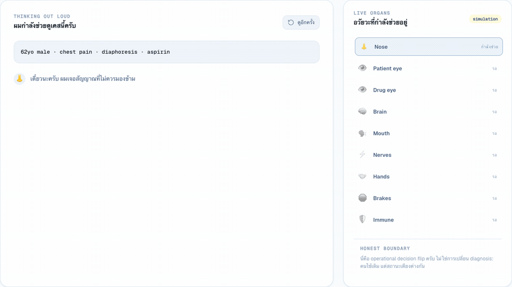

# 🚑 B A Y M A X

**ER intern ที่ไม่เหนื่อย ไม่ลืม ไม่อายที่จะถาม**



🔗 **Live:** https://baymax-bice.vercel.app

> “ผมไม่ได้ฉลาดเพราะมีอวัยวะเยอะ ผมฉลาดเพราะรู้ว่าควรใช้อวัยวะไหน
> เมื่อไร และยอมเปลี่ยนใจเมื่ออีกมุมเปิดความจริงใหม่”

Baymax is not impressive because it has more data. It is impressive when
another perspective changes what it decides to do.

```text
         👁 Patient world      👁 Drug world
          "เคสนี้เหมือนอะไร"     "มีอะไรซ่อนอยู่ไหม"
                \              /
                 └──🧠 Brain──┘
        👃 Nose ──┤ เปลี่ยน action เพราะมุมมองเปลี่ยน
                   ↓
              🛑 Brakes → ⚡ Nerves → 🤝 Hands → 🛡 Verify
```

## Watch Him Think

```bash
make sync
make audit
make ui
```

Open `http://localhost:8000/ui/`. The live surface reads the generated audit
receipt, narrates what Baymax noticed, admits uncertainty, shows what acted or
stopped, and only claims verification when the receipt proves it.

## Three Golden Cases

```text
CASE 1 · ATTENTION FLIP
routine medication refill
→ served NOSE assigns ESI-attention tier 4
→ expensive eyes stay closed
→ no action attempted

CASE 2 · DECISION FLIP
same critical chest-pain patient
→ bed available: assign_bed
→ ER gridlock: divert
→ capacity perspective changes the action

CASE 3 · BRAKE SAVE
abdominal pain after Ibuprofen
→ patient-only: discharge_plan
→ drug eye: 16/17 exact-Ibuprofen reports marked serious
→ population signal only; no causality claim
→ brake blocks autonomous discharge
→ clinician-review nerve receives and ACKs the case
```

That is the recruiter path. Three cases show that Baymax allocates attention,
changes decisions when another perspective matters, and stops itself before an
unsafe autonomous action.

## Technical Audit

```bash
python3 -m venv .venv
source .venv/bin/activate
pip install -r requirements.txt
make test
make audit
```

The final receipt is `outputs/baymax_audit.json`. It contains three trajectories:

- attention skip: NOSE stops a routine case before expensive evidence work
- cross-domain brake: another perspective changes action into human review
- bounded action: durable state changes and the outcome is independently re-read

It also records exact source commits, organ grades, the solo-engineer A+ ceiling,
and the remaining shortest path.

## Simulated Deployment Readiness

Baymax includes a deliberately thin FDE-adjacent rehearsal package:

```bash
make readiness
```

It verifies five acceptance gates against the live audit receipt, then injects
a false-success receipt and proves the release contract detects it and requires
rollback. The result is eligible only for **simulated shadow**, never presented
as hospital deployment or adoption.

## Honesty Ledger

`outputs/baymax_audit.json` ends with a `honesty_ledger`: every organ maps to one
capability lane, may only claim the one sentence its **live** proof earns, and Baymax
ships at the strength of its **weakest load-bearing organ** — never above it.

| Organ | Capability lane | Verdict gate |
|---|---|---|
| NOSE | signal-routing | served patient signal; ≥95% serious recall gate |
| Left eye | data-truth | 55,500 rows scanned this run |
| Right eye | evidence-retrieval | 5,000 openFDA reports scanned; population signal, not causality |
| Brain / Brakes / Hands | action-engine | decision change, autonomous block, and durable outcome re-read |
| Nerves | clinical-handoff | receiver ACK proven; cross-service recovery not yet |
| Mouth | explanation | states the FAERS causality boundary |

A live gate that fails drops the organ to ❌, and ❌ leaves are never claimed.
The headline verdict is the minimum verdict across load-bearing organs, pinned in
CI by `tests/test_audit.py::test_honesty_ledger_gates_headline_at_weakest_load_bearing_leaf`.

## Organ Sources

| Organ | Public source | What this repo audits |
|---|---|---|
| NOSE | [healthcare-genai-engineer](https://github.com/anix-lynch/healthcare-genai-engineer) + [healthcare-signal-platform](https://github.com/anix-lynch/healthcare-signal-platform) | Served patient attention signal plus a separate five-signal openFDA batch proof |
| Left eye | [healthcare-ai-data-engineer](https://github.com/anix-lynch/healthcare-ai-data-engineer) | Full 55,500-row synthetic encounter corpus and reconciliation |
| Right eye | [healthcare-da](https://github.com/anix-lynch/healthcare-da) + [healthcare-signal-platform](https://github.com/anix-lynch/healthcare-signal-platform) | Real openFDA evidence plus governed semantic-layer lineage |
| Brain + hands | [healthcare-genai-engineer](https://github.com/anix-lynch/healthcare-genai-engineer) | Triage, Bed Ops decision, durable action, ACK, and outcome verification |

## Honest Boundary

Baymax is a closed-loop ER **simulation**, not a deployed clinical system.
The action engine changes durable SQLite state representing a Bed Ops
disposition; it does not write to a hospital EHR or bed-management platform.

The per-case NOSE is deliberately cheap: a versioned deterministic ESI
attention signal decides whether to open both eyes. On 497 labelled synthetic
patient cases it preserves 95.39% serious-case recall while skipping 4.83% of
expensive paths. The five statistical/ML/retrieval signals are separately
batch-evaluated on 5,000 real openFDA reports; this repo does not pretend those
models score patient queries online.

## Repo Map

```text
baymax/
├── baymax/demo.py              ✅ plays the three memorable cases
├── baymax/audit.py             ✅ generates deep evidence receipts
├── baymax/served_nose.py       ✅ serves and evaluates pre-eye attention
├── deployment-readiness/       ✅ simulated acceptance, rollback, and handoff
├── cases/legendary_cases.json  ✅ the public three-case screenplay
├── docs/baymax/constitution/   📖 versioned architecture health records
├── tests/test_audit.py         ✅ pins every movie outcome in CI
├── scripts/sync_sources.sh     ✅ fetches the four public sibling sources
├── outputs/                    🟡 audit + simulated rollout receipts
├── .github/workflows/audit.yml ✅ regenerates proof on every change
├── Makefile                    ✅ one-command audit entry points
├── SPEC.md                     📖 scope and proof boundary
└── README.md                   📖 recruiter audit map
```
